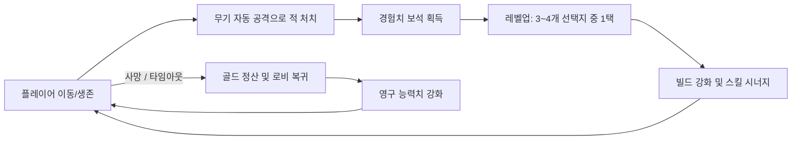

# 뱀서라이크 (Vampire Survivors-like) PRD

## 1. 프로젝트 개요
- **프로젝트명**: 뱀서라이크 (가칭)
- **장르**: 2D 탑다운 로그라이크 액션 / 탄막 서바이벌 (Bullet Heaven / Auto-Shooter)
- **개발 엔진**: Godot Engine 4.x (GDScript)
- **타겟 플랫폼**: PC (Windows) 우선, 모바일 확장 고려
- **핵심 컨셉**: "이동에만 집중하는 단순한 조작, 끊임없이 몰려드는 대규모 몬스터 소탕, 로그라이트 빌드 조합의 쾌감"

---

## 2. 핵심 게임 루프 (Core Game Loop)

1. **전투 & 생존**: 플레이어는 8방향 이동만 제어하며, 공격은 사거리 내 적에게 자동 발사.
2. **파밍 & 레벨업**: 처치된 적이 드랍하는 경험치 보석/아이템을 수집하여 레벨업.
3. **선택 & 빌드 구축**: 레벨업 시 무작위 3~4개 스킬/패시브 중 하나를 선택해 캐릭터 스펙 업.
4. **위기 & 보스전**: 시간 경과에 따라 몬스터 수량과 강도가 증가하며 주기적으로 보스 등장.
5. **결과 & 영구 성장**: 생존 실패 또는 제한 시간 달성 시 획득한 골드로 영구 스탯 업그레이드 후 재도전.

---

## 3. 핵심 시스템 명세

### 3.1. 플레이어 (Player)
- **조작**: 키보드 WASD / 방향키 (모바일 확장 시 가상 조이스틱)
- **기본 스탯**:
  - `Max Health` (최대 체력) & `Current Health` (현재 체력)
  - `Move Speed` (이동 속도)
  - `Pickup Radius` (아이템 자석 범위)
  - `Damage Multiplier` (피해량 계수)
  - `Cooldown Reduction` (쿨다운 감소)
  - `Projectile Count` (투사체 추가 수량)
- **상태 관리**: 무적 시간 (피격 후 짧은 깜빡임), 사망 처리.

### 3.2. 공격 및 스킬 시스템 (Weapons & Passives)
- **자동 공격 규칙**: 쿨다운이 돌 때마다 가장 가까운 적을 조준하거나, 플레이어 주변에 방사형/회전형으로 발사.
- **슬롯 제한**: 무기 최대 4~6개, 패시브 아이템 최대 4~6개.
- **초기 무기 아이콘/스킬 예시**:
  1. *단검/화살*: 가장 가까운 적을 향해 직선 투사체 발사.
  2. *마법 회전체 (오브/책)*: 플레이어 주변을 회전하며 접근하는 적에게 지속 피해.
  3. *번개/폭격*: 화면 내 무작위 적 위치에 낙뢰 광역 피해.
  4. *마늘/성수*: 플레이어 주변에 지속 데미지 장판 생성.
- **스킬 진화 (Weapon Evolution)**:
  - 특정 무기 만렙(Lv 8) + 특정 패시브 보유 상태에서 보스 상자 획득 시 진화 무기로 각성.

### 3.3. 몬스터 및 스포너 (Enemy & Wave Spawner)
- **스폰 메커니즘**:
  - 카메라 뷰포트 바깥의 일정 반경 원형 테두리에서 스폰.
  - 플레이어를 목표 지점으로 삼고 단순 추적 이동.
- **타임 테이블 기반 웨이브**:
  - 0~2분: 느리고 약한 잡몹 (박쥐, 슬라임)
  - 2~5분: 개체 수 증가 + 체력 높은 몹 (좀비, 스켈레톤)
  - 5분/10분 단위: 대형 엘리트 / 보스 몬스터 등장 (처치 시 보물상자 드랍)
- **충돌 및 피격**:
  - 적 피격 시 넉백(밀려남) 및 붉은색 플래시 효과.

### 3.4. 드랍 아이템 및 인터랙션 (Drops & Pickups)
- **경험치 보석**: 초록(기본), 파랑(중형), 빨강(대형). 플레이어 자석 범위 진입 시 부드럽게 끌려옴.
- **골드/코인**: 영구 업그레이드용 재화.
- **소모품**:
  - 고기/포션 (체력 회복)
  - 자석 (화면 내 모든 경험치 보석 즉시 흡수)
  - 폭탄 (화면 내 모든 일반 몬스터 처치)
- **보물상자**: 보스 처치 시 등장, 1~3개 스킬 즉시 업그레이드 + 대량 골드 지급.

### 3.5. 메타 프로그레션 (Meta Progression / Shop)
- 게임오버 후 로비 상점에서 골드로 영구 업그레이드:
  - 공격력 증가 (+5% per rank)
  - 최대 체력 증가 (+10 per rank)
  - 이동 속도 증가 (+5% per rank)
  - 자석 범위 증가 (+10% per rank)
  - 경험치 획득량 증가 (+5% per rank)

---

## 4. UI / UX 명세

1. **인게임 HUD**:
   - 상단: 경험치(EXP) 게이지 바 + 현재 레벨 표시
   - 상단 중앙: 생존 타이머 (MM:SS) + 처치 수 (Kill Count)
   - 좌측 상단: 플레이어 체력 바 + 장착 중인 무기/패시브 아이콘 슬롯
2. **레벨업 팝업**:
   - 게임 일시정지 (Engine TimeScale = 0 또는 Tree.paused = true)
   - 3~4장의 선택 카드 (아이콘, 스킬명, 현재 레벨 -> 다음 레벨 효과 설명)
3. **결과 화면 (Game Over / Clear)**:
   - 생존 시간, 처치 몬스터 수, 획득 골드, 무기별 가한 피해량 통계, 재도전/로비 버튼.
4. **로비 화면**:
   - 게임 시작 버튼, 영구 강화 상점, 캐릭터 선택창.

---

## 5. Godot 4 기술 설계 및 최적화 포인트

1. **데이터 기반 설계 (Data-Driven with Resources)**:
   - 무기 데이터(`WeaponData.gd`), 적 데이터(`EnemyData.gd`)를 Godot `Resource` (`.tres`)로 정의하여 밸런싱 및 추가를 간편화.
2. **대량 엔티티 최적화 (Mass Entity Optimization)**:
   - 화면에 수백 마리의 몬스터가 동시 존재하므로, 무거운 Node 트리 구조 대신 가벼운 `Area2D` 또는 `PhysicsServer2D` 활용 고려.
   - 경험치 보석은 개별 물리 연산 대신 플레이어 거리 체크 + Tween 연출 또는 오브젝트 풀링(Object Pooling) 적용.
3. **컴포넌트 패턴 (Composition)**:
   - `HurtboxComponent`, `HitboxComponent`, `HealthComponent` 분리로 모듈화 및 재사용성 극대화.

---

## 6. 개발 단계별 마일스톤 (Milestones)

| 단계 | 목표 | 세부 구현 내용 |
|---|---|---|
| **Phase 1 (MVP 코어)** | 기본 생존 프로토타입 | - 플레이어 이동 (WASD) - 기본 무기 1종 자동 발사 - 기본 적 스폰 및 플레이어 추적 - 경험치 습득 및 기본 레벨업 |
| **Phase 2 (다양성 & 파밍)** | 빌드 구축의 재미 | - 무기 4종 + 패시브 4종 구현 - 레벨업 선택 카드 UI - 엘리트 몹 및 보물상자 연출 |
| **Phase 3 (완성도 & 메타)** | 게임 루프 완성 | - 무기 진화 조합 시스템 - 메타 프로그레션 (로비 상점 영구 스탯 업) - 웨이브 타임테이블(15~20분 생존 설계) |
| **Phase 4 (폴리싱 & 최적화)** | 감각 피드백 & 릴리즈 | - 타격감 강화 (화면 흔들림, 슬로우모션, 피격 플래시, SFX) - 대량 몬스터 오브젝트 풀링 및 성능 최적화 - 빌드 및 배포 |
